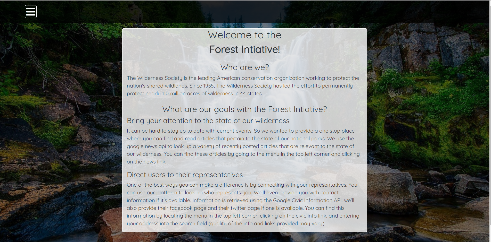
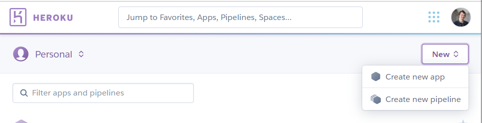
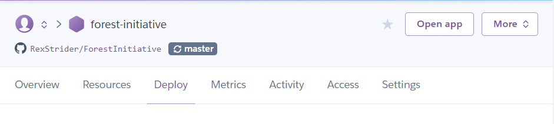
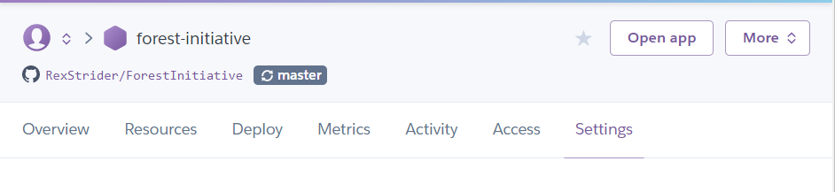

# ForestInitiative

A one stop website for learning about the state of our wilderness and getting in contact with our representatives.

## Team

[Aaron](https://github.com/RexStrider), [Jessie](https://github.com/JessieSidWho), and [Kit](https://github.com/kjonathante)

## Description

This application was originally conceived for the [Docusign 2019 Hackathon](https://2019-ds-momentum-hackathon.devpost.com/).

The purpose was to come up with an application for the [Wilderness Society](https://www.wilderness.org) that could bring awareness to the state of our wilderness and help direct user traffic to their representatives.

During the hackathon we got very ambitious with the features we were trying to implement. I have since parred down the application to two main features.

Retrieving articles related to the state of our wilderness, and connecting you to your representatives.

You can check out the demo at the following link.

### [The Forest Initiative](https://forest-initiative.herokuapp.com/)

## Getting Started

These instructions will get you a copy of the project up and running on your local machine for development and testing purposes. See deployment for notes on how to deploy the project on a live system.

### Prerequisites

You will need to install [NodeJS](https://nodejs.org/en/download/), and you will need API keys for the [News API](https://newsapi.org/) and [Google Civic Information](https://developers.google.com/civic-information/).

You will also need to have [Git](https://git-scm.com/) installed.

Also you might want to familiarize yourself with the Command Line Interface because this guide assumes you have some experience using a CLI and setting up your PATH environment variable.

If not, well here are some links that may help!

 - [Wikipedia article for Command Line Interface](https://en.wikipedia.org/wiki/Command-line_interface)
 - [How to set the path and environment variables in Windows](https://www.computerhope.com/issues/ch000549.htm)
 - [Where to Set Environment Variables in Mac OS X](http://osxdaily.com/2015/07/28/set-enviornment-variables-mac-os-x/)

Working with a CLI may seem daunting at first, but with some practice and patience you may find it faster and simpler to use over an IDE (Integrated Development Environment).

### Installation

First you will need to clone the repository.

Open your CLI and change the directory to wherever you want to install the project.

```
// example
cd <path-to-directory>
```

Then enter the following command,

```
// clone the repo using ssh
git clone git@github.com:RexStrider/ForestInitiative.git

// clone the repo using https
git clone https://github.com/RexStrider/ForestInitiative.git
```

Afterwards you will need to install the node dependecies for the server and the client side of the project.

Go to the root directory of the project and install the node dependencies.

```
npm install
// or
npm i
```

Then go to the client directory and install the node dependencies again.

```
cd client
npm i
```

You need to do both because there are different packages used for the server side and the client side.

There is one more step we need to do before we can run this project. Remember that this project uses the News API and Google Civic Information, so we need to reference the API keys somewhere to enable the application to use the APIs.

Assuming you are still in the client directory, you will need to go back to the root directory of the project.

After that, go to the config directory and create a file called "dev.js".

This is the file you will be referencing your API keys.

Enter the following code into the "dev.js" file, and make sure to use your api key surounded by qoutes in place of where it says "your-key-here".

```
 module.exports = {
    google_news_api: "your-news-api-key",
    google_civic_info_api: "your-civic-info-api-key"
};
```

Haven't signed up for your API keys? That's ok, you can get them for free by clicking on the following links.

 - [News API](https://newsapi.org/)
 - [Google Civic Information](https://developers.google.com/civic-information/)
 
Once all that is set up, you're basically ready to run the application.

Go back to the root directory of the project and enter the following command,

```
npm run dev
```

This should run the server side script and the front-end react script at the same time.

If you did everything correctly, you should eventually see the hompage for the Forest Initiative.



### Deployment

This project was deployed with [Heroku](https://www.heroku.com/).

Mostly because it is relatively simple to set up a Node application on Heroku. It also helps that it was free to set up. If you already have an account with Heroku, then just log in!

Signing up/logging in should direct you to your dashboard. Here you should see a button in the top right called "New". Click on that button and select "Create new application".



Give the application any name you please. Keep in mind the name does get used as part of the url associated witht he application, so try to keep it simple and straightforward.

This should take you to your applications overview page, and from here you will have to find the "Deploy" tab.



Click on the "Deploy" tab, select Github for the "Deployment method", and enter the name of the repository you want to deploy.

We're almost done, we just have one last thing to do before we deploy the branch. We have to add in the API keys into the configuration variables.

You may be thinking that we already did that when we created "dev.js" file, and I can understand the confusion.

However this is not the case. This project was specifically configured to hide the API keys it uses and this is done by not including the dev.js file in the repository.

If you look in the root directory of the repository, you can find a file called ".gitignore". All files referenced in this file are not included when adding, commiting, and pushing files to the repository.

This is why I had you create the "dev.js" file in the first place. We do this to have an added measure of security. For now just trust that it's best practice to hide your API keys, or you can do the research figure it out for yourself!

Point being, we need access to the API keys before deploying the build to production. Thankfully Heroku lets us set up the configuration variables for an application.

Click on the "Setting" tab on your application dashboard.



There should be a button that says "Reveal Config Vars".

Click on it and it should reveal two fields and an "Add" button.

In the "Key" put in the NAME of the API key, and in the value field enter the API key itself.

For reference the names of the api keys are,

```
google_news_api
google_civic_info_api
```

Or that's how they are referenced in this application.

Finally, Go back to the "Deploy" tab, scroll to the bottom of the page, and click on the "deploy branch" button.

Give it some time, and the after the application has deployed, you will be prompted to click on a button that will direct you to the deployed application.

## Built With

 - [NodeJS](https://nodejs.org/en/download/)
 - [Express](http://expressjs.com/)
 - [React](https://reactjs.org/)
 - [News API](https://newsapi.org/)
 - [Google Civic Information](https://developers.google.com/civic-information/)

## Future Features

Here is a list of features we had considered implementing

 - A map that you can click on, which would provide you with information about a particular park
 - a page that displayed various Change.org petitions relating to keeping our parks wild and our environment safe
 - A donate button that would allow you to donate money to the Wilderness Society, or some other charity that helped to protect our parks.
 - A contact form that connected you directly to [Sonny Perdue](https://en.wikipedia.org/wiki/Sonny_Perdue). He's been the United States Secretary of Agriculture since 2017 and has a big say in which areas are designated as wilderness (and therefore are protected by law).

 Ultimately it was all too much to do within the time alloted, but I liked the general idea so I decided to set up a prototype to get a sense of what this project could be.
 
 ## License
 
 This project is licensed under the MIT License - see the [LICENSE.md](./LICENSE.md) file for details
